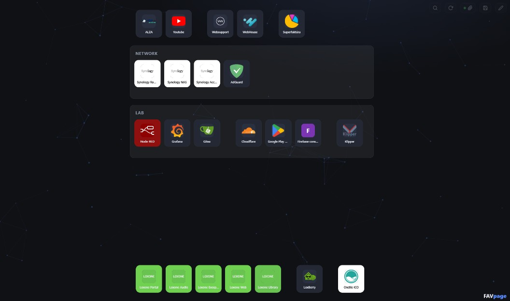

# FAVpage

**English** · [Slovensky](README.sk.md)

A personal start page / homelab dashboard in the spirit of Homarr or Heimdall — except the whole app is **a single HTML file with zero dependencies**. No server, no build step, no framework. Open it in a browser and it just works.

## Features

- **Free-form layout** — drag & drop tiles and groups anywhere on a 20 px grid. Elements never overlap: dropping onto an occupied spot pushes neighbours down ("make room"), and when a group shrinks, the elements below slide back up.
- **Groups** — resizable containers with custom titles and colors. Tiles can live inside a group or float freely on the board.
- **Multiple boards (tabs)** — a vertical dot rail on the left edge switches between boards (e.g. "Home", "Work"); names show on hover and the last item is a "+" that opens the board manager with the cursor ready in the new-board row. Everything stays in the one `links.js` (existing data migrates to the first board automatically), the last active board is remembered per browser, and `Alt+1…9` or `Ctrl+↑`/`Ctrl+↓` (cycling) switch from the keyboard. When a search has no hit on the current board, `Enter` jumps to the board that has one. A manager in the gear menu renames boards, recolors their rail dots, reorders them by drag & drop, hides/shows and deletes them (a deleted board's content moves to the first board), and adds new ones via an empty row below the list.
- **Open a whole group** — hovering over a group reveals a button in its header that opens every link of the group in new tabs (respecting the active search filter). Over 8 links asks for confirmation first; if the browser's pop-up blocker eats some tabs, a hint explains how to allow them.
- **Lasso multi-select** — in edit mode, drag across empty space to select multiple tiles, then move the whole selection at once (onto the board or into a group), keeping relative spacing.
- **Widgets** — live tiles that draw themselves from data and time, no APIs needed. **Clock**: time, date and the ISO week number with its even/odd parity (settings: 12/24 h, seconds, date, week). **Sprint**: a 14-day calendar strip showing where a team currently is in its two-week sprint — one widget per team, so two teams alternating on even/odd weeks are two widgets. Each widget has its own settings dialog (✎ in edit mode); the sprint one configures the team name, whether its sprints start on even or odd ISO weeks, and a team color (5 presets + a custom palette). Widgets move, resize and belong to boards like notes and sync via `links.js`.
- **Sticky notes** — pastel notes (4 colors) that live on the board like tiles. Click a note and type — it edits in place, no dialog; the first line renders bold as a title and changes save automatically. Resize it anytime by the bottom-right grip (shown on hover), create one from the gear menu (the cursor jumps straight in), move/recolor/delete it in edit mode, and search looks into note text too.
- **Add links by drag & drop** — drag a URL from the address bar, a bookmark, or a link on a page straight onto the board and a tile is created at the cursor (title taken from the link text or the domain, icon resolved automatically). Drop it inside a group to file it there; drop it on empty space for a free-floating tile.
- **Smart icons** — icon resolution cascade: custom value (a [dashboard-icons](https://github.com/homarr-labs/dashboard-icons) name, an image URL, or a `data:image/...` URI) → site favicon → colored letter avatar. One click downloads all icons and embeds them as base64 for fully offline use. Downloaded content is validated (MIME type + magic bytes), so an HTML page served instead of a favicon never gets embedded.
- **Availability monitoring** — tick "Watch availability" on a link and a status dot appears in the tile's bottom-right corner: green = online, red = offline, gray = unknown. Checked on page load and every 5 minutes (max 4 requests in parallel, 6 s timeout, offline only after 2 consecutive failures to avoid adblock/proxy false alarms). It is an HTTP reachability check via `no-cors` fetch — a real ICMP ping is not possible from a browser, and since the response is opaque, green means "the server responded", not "the page has no errors".
- **Tidy header** — permanently just two buttons: search and a gear. Everything else (save, connect, edit, add link/group, embed icons, accent, theme, language) rolls out as an icon column below the gear. The gear itself carries the connection dot and glows in the accent color when there are unsaved changes, so the state is visible even with the menu closed.
- **Two languages** — the UI speaks English and Slovak; the switcher sits in the gear menu and the choice is remembered in the browser. Default is English.
- **Light & dark theme** — sun/moon toggle in the gear menu; the first visit follows the system preference, then the choice is remembered in the browser. The accent color has a picker in edit mode and lives in the data (`meta.accent` in `links.js`), so it syncs across computers — even the animated background recolors instantly.
- **Hover effect** — a rotating gradient border in the icon's dominant color (extracted at runtime, cached).
- **Animated background** — a subtle particle network (30 % alpha) drawn on a canvas behind the content; pauses automatically when the tab is hidden.
- **Instant search** — press `/` or click the magnifier to roll out the search box; results filter as you type, `↓`/`↑` move between them and `Enter` opens the highlighted one in a new tab. When nothing matches, `Enter` searches the web for the query instead (Google by default; set `meta.searchUrl` in `links.js` to use another engine, e.g. `"https://duckduckgo.com/?q="`). `Esc` clears and collapses the box.
- **No accounts, no cloud** — your data is one readable JavaScript file next to the HTML.

## Getting started

1. Grab `index.html` and `links.js` and put them in one folder.
2. Open `index.html` in **Chrome, Edge, or Brave** (saving uses the File System Access API; other browsers can view the page but not save).
3. Open the **gear menu** (top right) and click the **paperclip** to pick your `links.js` — from now on every change is saved automatically. The connection state shows as a small dot on the gear and on the paperclip button.
4. In the gear menu click the **pencil** — or press and hold any tile or group for **3 seconds** — to enter edit mode:
   - drag groups by the `⠿` handle, resize them by the bottom-right corner,
   - drag tiles anywhere — within a group, into another group, or onto the open board,
   - use the `+` buttons to add links and groups.

## Data, sync between computers

All data lives in `links.js` (`window.FAV = {...}`) — groups, links, positions, icons — with a content timestamp (`meta.updatedAt`) bumped on every change.

- Every change is also cached in `localStorage`, so unsaved work survives a refresh or a crash.
- **On start** the newer of file vs. cache wins; adopted unsaved work is flagged so you remember to save it.
- **In the background** (on window focus and once a minute) the connected file's timestamp is compared — when another computer wrote a newer version, it is loaded automatically. Local unsaved changes are never silently overwritten; conflicts only produce a warning.

Put the folder in any synced location (Nextcloud, Dropbox, Syncthing, a network share…) and every computer sees the same board. Any machine can add links; the timestamps sort it out.

As a safety net, every save sanitizes icon data: any `data:` icon that is not a real image is dropped and the link falls back to the automatic icon chain.

## Keyboard shortcuts

| Key | Action |
|---|---|
| `/` | open & focus search |
| `↓` / `↑` | move between search results |
| `Alt+1…9` | switch to board 1…9 |
| `Ctrl+↑` / `Ctrl+↓` | cycle through boards |
| `Enter` | open the highlighted result — or search the web when nothing matches; confirm dialog |
| `Esc` | clear search / cancel selection / close dialog |

## Tech notes

- Single file of vanilla ES5-style JavaScript and CSS, no dependencies.
- Collision layout is a simple axis-aligned "pack down" algorithm — the dropped element stays, overlapping neighbours shift down just enough to clear; it always terminates because y only ever increases.
- Availability checks use `fetch(url, { mode: "no-cors" })` with an `AbortController` timeout; links opt in individually (`ping: true` in `links.js`), so the page never fires requests for links you don't watch.
- Local preview during development: any static server, e.g. `python -m http.server`.

## Browser support

Full functionality (including saving) requires a Chromium-based browser with the File System Access API — Chrome, Edge, Brave, Opera. Firefox and Safari render the page fine but cannot write to `links.js`.
